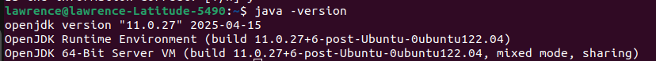
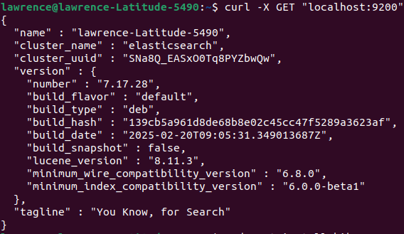
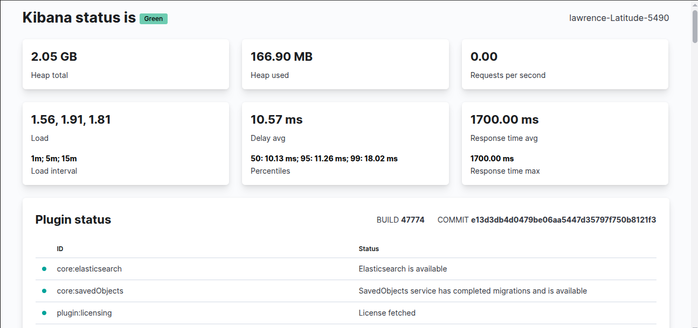
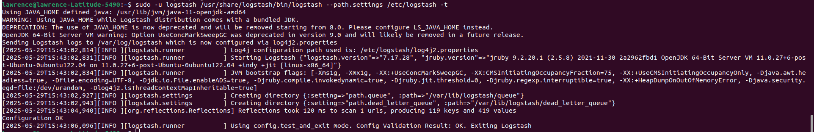
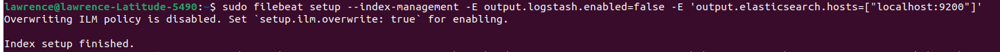
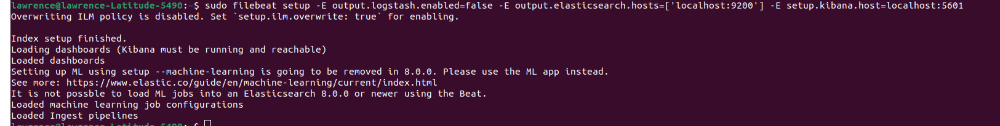

# 📘 Elastic Stack (ELK Stack) Installation Guide on Ubuntu 22.04

---
## 🧰 Prerequisites

- **Operating System**: Ubuntu 22.04 LTS  
- **User Privileges**: A non-root user with sudo privileges  
- **System Requirements**: Minimum 4 GB RAM and 2 CPUs  
- **Java Installation**: Required for Elasticsearch and Logstash
```bash
  sudo apt update
  sudo apt install -y openjdk-11-jdk
  java -version
```

---

## 🔐 Step 1: Add Elastic Repository and GPG Key

Import the Elastic GPG key and add the repository:

```bash
curl -fsSL https://artifacts.elastic.co/GPG-KEY-elasticsearch | sudo gpg --dearmor -o /usr/share/keyrings/elastic.gpg

echo "deb [signed-by=/usr/share/keyrings/elastic.gpg] https://artifacts.elastic.co/packages/8.x/apt stable main" | sudo tee /etc/apt/sources.list.d/elastic-8.x.list

sudo apt update
```
---

## 🔎 Step 2: Install and Configure Elasticsearch

Install Elasticsearch:

```bash
sudo apt install -y elasticsearch
```

Configure Elasticsearch:

```bash
sudo nano /etc/elasticsearch/elasticsearch.yml
```

Uncomment and set the following:

```yaml
network.host: localhost
```

Enable and start the service:

```bash
sudo systemctl enable elasticsearch
sudo systemctl start elasticsearch
```

Test Elasticsearch:

```bash
curl -X GET http://localhost:9200
```
---

---
---

## 📊 Step 3: Install and Configure Kibana

Install Kibana:

```bash
sudo apt install -y kibana
```

Configure Kibana:

```bash
sudo nano /etc/kibana/kibana.yml
```

Set:

```yaml
server.host: "localhost"
```

Enable and start Kibana:

```bash
sudo systemctl enable kibana
sudo systemctl start kibana
```
---
open this url in the browser
```bash
http://localhost:5601/status
```
---

---

## 🔄 Step 4: Install and Configure Logstash

Install Logstash:

```bash
sudo apt install -y logstash
```

Create a configuration file called 02-beats-input.conf

```bash
sudo nano /etc/logstash/conf.d/02-beats-input.conf
```
```bash
input {
  beats {
    port => 5044
  }
}
```
---
Create a configuration file called logstash.conf
```bash
sudo nano /etc/logstash/conf.d/logstash.conf
```

Example configuration:

```ruby
output {
  if [@metadata][pipeline] {
 elasticsearch {
   hosts => ["localhost:9200"]
   manage_template => false
   index => "%{[@metadata][beat]}-%{[@metadata][version]}-%{+YYYY.MM.dd}"
   pipeline => "%{[@metadata][pipeline]}"
 }
  } else {
 elasticsearch {
   hosts => ["localhost:9200"]
   manage_template => false
   index => "%{[@metadata][beat]}-%{[@metadata][version]}-%{+YYYY.MM.dd}"
 }
  }
}
```
---
Run test for logstash configuration
```bash
sudo -u logstash /usr/share/logstash/bin/logstash --path.settings /etc/logstash -t
```
---

---

Enable and start Logstash:

```bash
sudo systemctl enable logstash
sudo systemctl start logstash
```

---

## 📦 Step 5: Install and Configure Filebeat

Install Filebeat:

```bash
sudo apt install -y filebeat
```
open a configuration file called etc/filebeat/filebeat.yml

```bash
sudo nano /etc/filebeat/filebeat.yml
```
Uncomment these part in the file
```ruby
output.logstash:
  # The Logstash hosts
  hosts: ["localhost:5044"]
```
Save and close the file

---
Enable and configure the system module:

```bash
sudo filebeat modules enable system
```

Set up Filebeat:

```bash
sudo filebeat setup --pipelines --modules system
```
Load the setup template into elastic search:

```bash
sudo filebeat setup --index-management -E output.logstash.enabled=false -E 'output.elasticsearch.hosts=["localhost:9200"]'
```
---

---
Create the index pattern and load the dashboards into Kibana:

```bash
sudo filebeat setup -E output.logstash.enabled=false -E output.elasticsearch.hosts=['localhost:9200'] -E setup.kibana.host=localhost:5601
```
---

---
Enable and start Filebeat:

```bash
sudo systemctl enable filebeat
sudo systemctl start filebeat
```

---

## 🌐 Step 6: Configure Nginx as a Reverse Proxy for Kibana

Install Nginx:

```bash
sudo apt install -y nginx
```

Create an Nginx config file:

```bash
sudo nano /etc/nginx/sites-available/kibana
```

Add:

```nginx
server {
    listen 80;

    server_name your_server_ip;

    location / {
        proxy_pass http://localhost:5601;
        proxy_http_version 1.1;
        proxy_set_header Upgrade $http_upgrade;
        proxy_set_header Connection 'upgrade';
        proxy_set_header Host $host;
        proxy_cache_bypass $http_upgrade;
    }
}
```

Enable the config and restart Nginx:

```bash
sudo ln -s /etc/nginx/sites-available/kibana /etc/nginx/sites-enabled/
sudo nginx -t
sudo systemctl restart nginx
```

---

## 🔥 Step 7: Adjust Firewall Settings

Allow necessary ports:

```bash
sudo ufw allow 'Nginx Full'
sudo ufw allow OpenSSH
sudo ufw enable
```

---

## ✅ Step 8: Verify the Installation

Visit Kibana via browser:

```
http://your_server_ip
```

You should see the Kibana dashboard.

---

---

**Feel free to reach out if you need further assistance or customization for your setup!**


